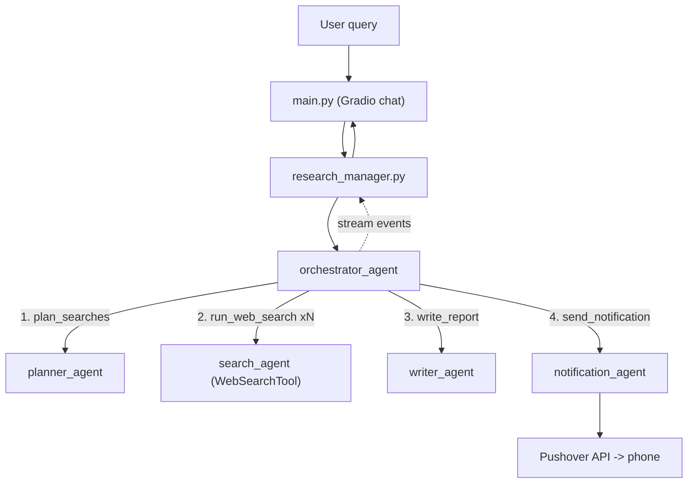

# Deep Research Agent

A multi-agent deep research assistant built on the [OpenAI Agents SDK](https://github.com/openai/openai-agents-python). Ask a research question and it plans web searches, runs them, writes a long-form markdown report, and sends a push notification to your phone when it's done.

## How it works

A single **orchestrator agent** is handed four other agents as *tools* and decides itself when to call each one:

1. **Planner agent** (`planner_agent.py`) — turns your query into a set of planned web searches (query + reason), no web access itself.
2. **Search agent** (`search_agent.py`) — called once per planned search; actually hits the web via `WebSearchTool` and returns a short summary.
3. **Writer agent** (`writer_agent.py`) — combines the original query with all the search summaries into a long-form markdown report (with a short summary and follow-up questions).
4. **Notification agent** (`notification_agent.py`) — turns the report's short summary into a push notification and sends it via [Pushover](https://pushover.net/).

`research_manager.py` streams the orchestrator's run and turns tool-call events into status updates ("Planning searches...", "Searching the web...", etc.), then extracts the final report once the writer agent's tool call returns.

`main.py` wraps all of this in a [Gradio](https://www.gradio.app/) chat UI.



## Setup

### 1. Clone and install dependencies

```bash
git clone https://github.com/CodeGeeths/deep-research-agent.git
cd deep-research-agent
python -m venv .venv
source .venv/bin/activate
pip install -r requirements.txt
```

### 2. Configure environment variables

Copy the example file and fill in your own keys:

```bash
cp .env.example .env
```

| Variable | Required | Description |
|---|---|---|
| `OPENAI_API_KEY` | Yes | OpenAI API key used by all agents (needs web search tool access). |
| `PUSHOVER_USER` | Yes | Your Pushover user key, from [pushover.net](https://pushover.net/). |
| `PUSHOVER_TOKEN` | Yes | An application token created in your Pushover dashboard. |
| `DEFAULT_MODEL_NAME` | No | Model used by every agent. Defaults to `gpt-5.4-nano`. |
| `HOW_MANY_SEARCHES` | No | Number of searches the planner agent plans per query. Defaults to `5`. |

Pushover notifications require the free [Pushover app](https://pushover.net/) installed on your phone, logged into the account tied to `PUSHOVER_USER`.

### 3. Run it

```bash
python main.py
```

This launches a local Gradio chat UI (URL printed in the terminal). Ask a research question and watch the status updates stream in, ending with the full markdown report — and a push notification on your phone.

## Observability

Each run prints a trace URL to the terminal/chat, e.g.:

```
Starting research. Trace: https://platform.openai.com/traces/trace?trace_id=...
```

Open it (while logged into the OpenAI account tied to your `OPENAI_API_KEY`) to see a step-by-step trace of every agent call, tool call, and model response for that run.
